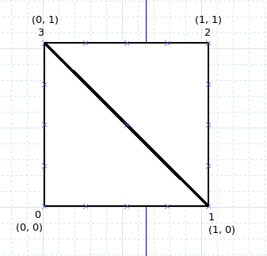

# Assignment 3 (Earthquake) Worksheet

## Q1: Useful math

In this assignment, you will be dealing with earthquake data from the United
States Geological Survey. As with any real-world dataset, the data have
real-world units, which may not always match up with units we want to use for
the data visualization. As such, there are a few handy practices commonly used
when constructing visualizations from real-world data; one of the most common
is normalization.

Normalization refers to the process of converting a number inside of an
arbitrary range, and converting it into a floating point number between 0.0
and 1.0, inclusive. For example, if we have a value `v = 1.5` in the list of
numbers `{0.0, 1.5, 2.0, 1.3}`, the normalized value would be `v_normalized =
0.75`.

```
/* You may use the following C++ standard library functions:
 *   - `std::min_element()` - return the minimum of a vector
 *   - `std::max_element()` - return the maximum of a vector
 *
 * Example usage:
 *    std::vector<float> quakes = {0.0, 1.5, 2.0, 1.3};
 *    float minMagnitude = std::min_element(quakes.begin(), quakes.end());
 */
```

Use the information in the above comment to create an algorithm that
normalizes the values in an arbitrary vector (list) and returns a new vector:

```
std::vector<float> normalizeList(std::vector<float> quakeList) {

  std::vector<float> normalized;
  float min = std::min_element(quakeList.begin(), quakeList.end());
  float max = std::max_element(quakeList.begin(), quakeList.end());

  for(int i = 0; i < quakeList.size(); i++){
    normalized.push_back((quakeList[i] - min)/ (max - min));
  }

    return normalized;
}
```

Now, to check that your algorithm works, use the following numeric definition
of the `quakes` list, and show the resulting `normalizedQuakes` list. A good
sanity check: make sure all the values in `normalizedQuakes` are between 0.0
and 1.0.

```
std::vector<float> quakes = {0.0, 2.3, 5.1, 1.1, 7.6, 1.7};
std::vector<float> normalizedQuakes = normalizeList(quakes);

for (int i = 0; i < normalizedQuakes.size(); i++) {
    std::cout << normalizedQuakes[i] << " ";
}
std::cout << std::endl;
```

```
output: 0.0 0.302632 0.671053 0.144737 1.0 0.223684
```

## Q2: Constructing a mesh

For the first two assignments, you likely relied on built-in graphics
libraries to provide the means for you to draw objects onto your screen. While
this is convenient for drawing simple objects like spheres and cubes (often
called "primitives"), it can be limiting, because you can't create your own
models, or add textures to them! For this assignment, you will create your own
3D model of the Earth (represented as a plane or a sphere), and apply a
satellite image texture to the model.

When creating a mesh from scratch, it's common practice to break it into small
triangles; triangles are quick to render on graphics cards because they're
supported in the hardware, and we don't lose too much quality by using them.
When breaking a model down into triangles, it's important to keep the concepts
**Vertex Arrays** and **Index Arrays** in mind. Vertex arrays hold the actual
coordinates for each point in your mesh, while index arrays tell the graphics
library how to display those vertices. Since we're using triangles, these
indices come in groups of three.


Create your own copy of the image below (using a piece of paper that you
photograph or a drawing program) and label each vertex with an index number
(starting at 0).

**Replace this image with your drawing:**



Now, write out the square's vertex array, using the familiar `Point3` class
(since it's in the *xy*-plane, you may assume z = 0 for all points):

```
std::vector<Point3> squareVertexArray = {
    /* --- Fill in your `Point3`s here */
    std::vector<Point3> vertexBuffer;
    vertexBuffer.push_back(Point3(0, 0, 0));
    vertexBuffer.push_back(Point3(1, 0, 0));
    vertexBuffer.push_back(Point3(1, 1, 0));
    vertexBuffer.push_back(Point3(0, 1, 0));
};
```

Lastly, write out the square's index array, based on the indices you defined
in the picture above (there should be 6 indices, since we have two
triangles!). Make sure your indices are defined in counter-clockwise order
(remember the right-hand rule?).

```
std::vector<int> squareIndexArray = {
    std::vector<unsigned int> indexBuffer;
    /* --- Fill in your first triangle indices --- */
    indexBuffer.push_back(0);
    indexBuffer.push_back(1);
    indexBuffer.push_back(3);
    
    /* --- Fill in your second triangle indices --- */
    indexBuffer.push_back(1);
    indexBuffer.push_back(2);
    indexBuffer.push_back(3);
};
```
